# Enterprise WMS UI Gap Analysis & Phased Implementation Plan

## Goal Description

The current `nest-wms-ui` application provides basic data-table views for warehouse records but lacks the **domain-specific workflows, multi-step wizards, status-driven automations, and operational widgets** required for enterprise-standard warehouse operations. 

To bridge this gap, this document presents a detailed, component-by-component comparison between the current implementation and a premium reference WMS implementation (`reference-wms-ui-frontend`). This comparison is written from the dual perspectives of:
1. **A Warehouse Management System (WMS) Domain Expert** who understands process integrity, warehouse layouts, legal documentation (GRNs), and picking/packing/shipping lifecycle constraints.
2. **A WMS UX Designer** who understands user cognitive load, deskless warehouse operator environments, scan-driven workflows, visual hierarchy, and the power of interactive step-by-step wizards.

This plan details the specific gaps in each domain (Inbound, Outbound, Inventory, Quality, Structure) and proposes a structured 3-phase roadmap to lift `nest-wms-ui` to enterprise-grade compliance, leveraging `shadcn` components, custom searchable controls, and unified dialog frameworks.

---

## User Review Required

> [!IMPORTANT]
> **API Backend Dependencies**  
> Many advanced UX flows in the reference design (e.g., status-driven receiving, real-time GRN status polling, wave allocation, LPN moving/nesting) rely on specialized backend service endpoints. We must ensure the backend endpoints listed in `GAP_ANALYSIS_IMPROVEMENTS.md` are fully integrated and accessible to the frontend.

> [!WARNING]
> **Data Table Overhaul & Server-Side Pagination**  
> We will transition the tables from basic client-side paginated structures to server-side paginated grids with page-size selectors, sort toggles, and global multi-field search. This will temporarily affect how data fetching queries are wrapped.

---

## Open Questions

> [!NOTE]
> **1. Barcode/RF Scanner Integration Strategy**  
> For the picking and packing screens, the reference implementation incorporates barcode scan input. Should we design these screens to support hardware barcode wedge scanners (keyboard emulation) or integrate direct camera scanning API libraries?  
> *Recommendation: Start with keyboard emulation (capturing raw `keydown` event buffers) as it is the standard for warehouse RF devices.*

> [!NOTE]
> **2. 3D Warehouse Visualization**  
> The reference implementation contains a placeholder for a 3D Warehouse layout view. Do we want to prioritize building a canvas-based 3D grid layout, or should we focus on a 2D high-density slotting rack view?  
> *Recommendation: Prioritize a 2D high-density interactive rack layout for initial phases, as it provides higher operational utility for warehouse admins.*

---

## Technical Domain & Gap Analysis

```mermaid
graph TD
    subgraph Inbound Process
        A[Create ASN with Line Items] --> B[Mark Arrived]
        B --> C[Start Receiving & Poll GRN]
        C --> D[Quality Inspection Checklist]
        D --> E[Putaway Task Guidance]
    end
    subgraph Outbound Process
        F[Create Sales Order with Lines] --> G[Allocate Inventory]
        G --> H[Create Pick Wave]
        H --> I[Task-Based Picking]
        I --> J[Scan Packing & Cartonization]
        J --> K[Generate Manifest & Ship]
    end
    subgraph Warehouse Catalog & Setup
        L[Setup Wizard: Zones/Aisles/Racks] --> M[Putaway Rule Designer]
    end
```



---

### 1. INBOUND OPERATIONS (ASNs, GRNs, Putaway, Appointments)

#### A. WMS Expert Perspective (Process & Domain Integrity)
In a professional warehouse, an Advance Shipping Notice (ASN) is the manifest of what is expected. An ASN without **Line Items** (specific products, expected quantities, UOMs, and lot/expiry tracking requirements) is useless. 
The receiving process represents a transfer of financial and physical liability. When a truck rolls up:
1. The **Dock Appointment** is checked.
2. The ASN is updated to **ARRIVED**, which must immediately trigger the creation of a **Goods Receipt Note (GRN)**.
3. The operator performs **Goods Receiving** by scanning items, counting physical stock, capturing **Lot Numbers** and **Expiry Dates** (vital for food/pharma shelf-life), and comparing them against expected ASN counts.
4. Any discrepancy generates a discrepancy report, and goods are sent for **Quality Inspection** before a **Putaway Task** is created to move stock from the receiving dock to a storage location.

*The Gap:* The current `AsnList.tsx` has *no* line items and *no* receiving flow. It only allows typing a flat text PO number and carrier name. It has no way of registering what products are on the truck, making receiving impossible.

#### B. WMS UX Designer Perspective (Layout, Widgets, and Interaction)
Inbound receiving is high-pressure. Operators stand at docks, often in noisy environments, holding RF devices or tablets. 
* **Multi-Step Wizard:** Creating an ASN should be a 3-step wizard (Basic Info -> Line Items with searchable product select -> Review) to keep forms manageable.
* **Status-Driven Action Menus:** Operators should not copy-paste UUIDs to trigger actions. A row-level contextual menu must show allowed actions based on the ASN's lifecycle status.
* **Operational KPI Cards:** High-density, compact stats cards (Pending | In Transit | Arrived | Received) at the top of the page provide real-time status.

```
+---------------------------------------------------------------------------------+
|  INBOUND ASN OPERATIONS                                       [Create ASN Button] |
+---------------------------------------------------------------------------------+
| [ KPI: Pending (5) ]  [ KPI: In Transit (3) ]  [ KPI: Arrived (2) ]  [ KPI: Recv (12) ] |
+---------------------------------------------------------------------------------+
|  Search & Filters: [Search ASN...] [All Status v] [Client v]     [Clear Filters] |
+---------------------------------------------------------------------------------+
|  ASN #      | PO #     | Client   | Expected Date | Status       | Actions      |
|  ASN-9902   | PO-1029  | Acme     | 2026-06-01    | ARRIVED      | [Menu v]     | -> Start Receiving
|  ASN-8821   | PO-2009  | Globex   | 2026-05-29    | CREATED      | [Menu v]     | -> Manage Lines / Mark Arrived
+---------------------------------------------------------------------------------+
```

#### C. Detail Comparison Table

| Feature / Widget | Current `nest-wms-ui` | Reference Implementation | Action Required |
| :--- | :--- | :--- | :--- |
| **ASN Creation** | Single-page basic form dialog. Free-text inputs. No line items. | 3-Step Wizard (`AsnCreateWizard.tsx`) with searchable clients, vendors, UOMs, and products. | **Replace** with Multi-step Wizard Dialog. |
| **ASN Table Actions** | No row action menu. Text inputs to "Preview" or "Update Status" by manually typing an ID. | Context-sensitive dropdown actions based on status (e.g. `startReceiving` enabled only if status is `ARRIVED`). | **Implement** `MoreVertical` dropdown action menu. |
| **Receiving Flow** | None. | Step-by-step `AsnReceivingDialog.tsx` showing GRN creation, goods scanning, status polling, and success summaries. | **Build** full receiving wizard widget. |
| **Putaway Tasks** | Flat list table with a simple status change form. | Guided `PutawayPage.tsx` showing source location (Dock), destination location, and scanning verification. | **Upgrade** Putaway page with barcode scanner inputs and location suggestions. |

---

### 2. OUTBOUND OPERATIONS (Sales Orders, Waves, Picking, Packing, Shipping)

#### A. WMS Expert Perspective (Process & Domain Integrity)
Outbound logistics is where warehouse efficiency directly impacts customer satisfaction. 
1. **Sales Orders** are ingested with line items specifying SKU, ordered quantity, pricing, and UOM.
2. The WMS runs an **Allocation Engine** to lock inventory in specific storage locations (using picking strategies like FIFO or FEFO).
3. Orders are grouped into **Waves** based on shipping carrier, priority, or warehouse zone to optimize the picker's travel path.
4. **Picking Tasks** guide operators through the aisles, requiring barcode scans of both the location and the product SKU to ensure 100% accuracy.
5. **Packing Stations** support cartonization (identifying correct box sizes), weight validation, and printing packing lists.
6. **Shipping/Manifesting** prints the final carrier label, registers the shipment with tracking, and moves status to DEPARTED.

*The Gap:* The current `OrderList.tsx` has *no* lines and *no* picking/packing workspace. It is a pure flat table. Orders cannot be allocated or wave-picked because they have no products associated with them.

#### B. WMS UX Designer Perspective (Layout, Widgets, and Interaction)
* **Unified Order Workbench:** Instead of disjointed lists, admins need a consolidated dashboard (`OrderWorkbenchPage.tsx`) that shows the status of every order line, allocation progress, and wave assignment.
* **Scan-Focused Picking Screen:** Pickers need an ultra-simplified interface showing *one task at a time* (Location -> SKU -> Scan to Confirm) with large text, progress indicators, and "Short Pick" exception buttons.
* **Carton Packing Panel:** A dedicated packing panel displaying open items in the order, scanned items in the box, and a weight/dimensions form with auto-label generation.

```
+----------------------------------------------------------------------------+
|  OUTBOUND ORDER WORKBENCH                                                  |
+----------------------------------------------------------------------------+
|  Orders Grid:                                                              |
|  [x] Order #  | Client  | Allocated?  | Wave # | Status    | Actions       |
|  [-] SO-5582  | Acme    | [90%]       | Wave-1 | ALLOCATED | [Assign Wave] |
|    └--> Lines:  SKU: ITEM-A | Qty: 10 | Picked: 0 | Packed: 0              |
|                 SKU: ITEM-B | Qty:  5 | Picked: 5 | Packed: 0              |
+----------------------------------------------------------------------------+
```

#### C. Detail Comparison Table

| Feature / Widget | Current `nest-wms-ui` | Reference Implementation | Action Required |
| :--- | :--- | :--- | :--- |
| **Order Creation** | Basic form. No line items. | 3-step `SalesOrderCreateWizard.tsx` (Info -> Lines with price/UOM -> Review). | **Replace** with Sales Order Create Wizard. |
| **Order Workspace** | Flat table. | `OrderWorkbenchPage.tsx` with hierarchical lines display and wave assignment. | **Create** unified Outbound Order Workbench. |
| **Wave Management** | Flat table, basic fields. | Wave creation, release controls, and visual wave optimization panels. | **Add** wave creation dialogs and allocation status bars. |
| **Picking Tasks** | Flat table listing. | Scan-focused `PickingPage.tsx` showing active picking tasks and step-by-step scanning workflows. | **Build** mobile-optimized picking task workbench. |
| **Packing & Shipping** | Flat tables. | Dedicated packing station panels (`PackingPage.tsx`) and manifest shipping panels (`ShippingPage.tsx`). | **Build** dedicated packing scan layout and print label modules. |

---

### 3. INVENTORY MANAGEMENT (Stock Levels, LPNs, Relocations, Holds, Replenishment)

#### A. WMS Expert Perspective (Process & Domain Integrity)
In modern warehouses, inventory is rarely tracked as just a flat quantity in a location. It is grouped into **License Plate Numbers (LPNs)** (e.g. pallets, boxes, bins). Moving a pallet requires scanning the LPN barcode, which automatically transfers all nested products. 
Furthermore, inventory must be segregated by **Status** (Available, Damaged, QA Hold, Suspended). If a batch of products is found defective, a **QA Hold** must be applied to all affected stock, blocking them from allocation. **Forward Pick Replenishment** ensures picking locations are topped up from bulk storage when inventory drops below a minimum threshold.

*The Gap:* The current project has a flat `StockList.tsx` that treats products as simple SKU/quantity records. It lacks LPN hierarchy management, and there is no workflow to perform inventory relocations or cycle count scheduling.

#### B. WMS UX Designer Perspective (Layout, Widgets, and Interaction)
* **LPN Tree-View Structure:** A nested tree-view display showing Pallet LPN -> Case LPN -> SKUs/Quantities, with direct buttons to "Nest LPN" or "Move LPN".
* **Interactive Hold Dialogs:** Reusable `ApplyHoldDialog` and `ReleaseHoldDialog` with dropdowns for hold reasons and affected quantity validation.
* **Dual-Column Relocation Board:** A side-by-side or step-by-step layout for warehouse moves (Source Location -> Scan SKU/LPN -> Target Location -> Confirm).

#### C. Detail Comparison Table

| Feature / Widget | Current `nest-wms-ui` | Reference Implementation | Action Required |
| :--- | :--- | :--- | :--- |
| **LPN Operations** | Flat LPN list. No hierarchy or actions. | LPN nesting, LPN movements, barcodes, and nested hierarchy cards. | **Implement** interactive LPN detail cards and nest/unnest actions. |
| **Stock Inquiry** | Simple table with UUID filters. | Rich `inventory.inquiry.tsx` with SKU, Location, LPN, Lot#, Serial, and Hold status. | **Upgrade** Stock levels list to full Inventory Inquiry. |
| **Adjustments & Holds** | Basic forms. | Reusable `AdjustStockDialog.tsx`, `ApplyHoldDialog.tsx` with hold codes. | **Replace** inline hold forms with modular standard dialogs. |
| **Inventory Moves** | None. | Dedicated moves grid (`inventory.moves.tsx`) and `TransferLocationDialog.tsx`. | **Create** Inventory Relocations Page. |

---

### 4. QUALITY & COMPLIANCE (Inspections, NCRs, Exceptions)

#### A. WMS Expert Perspective (Process & Domain Integrity)
Quality Control acts as the gatekeeper. When products require quality inspection (triggered automatically by GRN receiving rules for certain vendors or SKUs), the inventory is locked in a **Quality Zone**. 
The quality inspector uses the WMS to log inspection details: sample size, pass/fail counts, defect photos, and compliance notes. Failing items generate a **Non-Conformance Report (NCR)**, routing them to scrap or return-to-vendor status, while passing items are released to available stock.

*The Gap:* The current project has an empty `Ncrs.tsx` page and no quality control components whatsoever.

#### B. WMS UX Designer Perspective (Layout, Widgets, and Interaction)
* **Quality Checklists:** High-density checklists displaying inspection points, with colored buttons for Pass (Green), Fail (Red), or Conditional (Orange).
* **Defect Log Widget:** Upload/photo placeholder widgets with custom notes textareas.

#### C. Detail Comparison Table

| Feature / Widget | Current `nest-wms-ui` | Reference Implementation | Action Required |
| :--- | :--- | :--- | :--- |
| **Quality Portal** | None. | Unified Quality Dashboard (`QualityPage.tsx`). | **New Feature:** Add Quality Control dashboard. |
| **Quality Inspections** | None. | List, filters, and detailed checklists (`QualityInspectionDetailPage.tsx`). | **New Feature:** Build Quality Inspection detail cards. |
| **Inspecting Receipts** | None. | Dialog-driven inspections directly from GRN flow (`GrnQualityInspectionDialog.tsx`). | **New Feature:** Connect GRN receiving status to QA inspection triggers. |

---

### 5. WAREHOUSE SETUP & CATALOG (Facilities, Zones, Aisles, Racks, Locations, Setup Wizards)

#### A. WMS Expert Perspective (Process & Domain Integrity)
A warehouse is a complex physical coordinate system. The grid must be configured as a nested hierarchy: **Facility -> Zone (Receiving, Bulk, Pick, Quality) -> Aisle -> Rack Row -> Bay -> Level -> Location (Slot)**. 
Without this hierarchy, the system cannot compute travel path optimizations, maximum weight constraints per rack level, or putaway rules (e.g. "hazardous items must go to Hazmat Zone").

*The Gap:* The current setup only has simple Facilities, Zones, and Locations lists. There is no concept of aisles, racks, bays, or levels, and there is no setup tool to initialize a warehouse.

#### B. WMS UX Designer Perspective (Layout, Widgets, and Interaction)
* **7-Step Setup Wizard:** Onboarding a new facility should not involve manually creating thousands of locations. A 7-step wizard (`WarehouseSetupWizard.tsx`) should allow users to enter layout parameters (e.g. "Aisles A-E, 5 bays per aisle, 4 levels per rack") and auto-generate the physical location coordinates in one click.
* **Putaway Rule Designer:** A drag-and-drop or rule builder interface (`PutawayRuleDesigner.tsx`) to set priority zones based on product attributes.

#### C. Detail Comparison Table

| Feature / Widget | Current `nest-wms-ui` | Reference Implementation | Action Required |
| :--- | :--- | :--- | :--- |
| **Warehouse Hierarchy** | Facilities, Zones, Locations. No intermediate structures. | Aisles, Bays, Racks, Levels, and automated barcode label generation. | **New Feature:** Add Aisle, Bay, and Rack management routes. |
| **Structure Setup** | Manual individual creations. | 7-step `WarehouseSetupWizard.tsx` to batch-generate warehouse hierarchies. | **Replace** manual setup with Setup Wizard. |
| **Rules Configurator** | None. | Visual `PutawayRuleDesigner.tsx` for zone picking and putaway strategies. | **New Feature:** Build Putaway Rules configuration panel. |

---

### 6. ARCHITECTURE & UI/UX FOUNDATIONS (Shared Controls, Dialogs, Navigation)

#### A. WMS Expert Perspective (Process & Domain Integrity)
System speed is critical in a warehouse. Every second spent loading or looking up items degrades sorting speed.
* **Role-Based Navigation:** The system must restrict operations. A warehouse picker's screen should contain only outbound picking tasks and barcode scans. A warehouse admin needs workbench controls, while a tenant admin needs pricing, client catalog, and user setups.

#### B. WMS UX Designer Perspective (Layout, Widgets, and Interaction)
* **Shared Dialog Library:** Move away from page-level, messy inline dialogs. Implement a clean `/components/dialogs` folder housing reusable dialogs.
* **Custom Searchable Selects:** Reusable, debounced inputs (`ProductSearchSelect.tsx`, `ClientSelect.tsx`, `VendorSelect.tsx`, `LocationSelect.tsx`) that display matching records with client-side or server-side filtering, showing names and codes instead of confusing raw database IDs.
* **Filter Chips:** Active filters displayed as removable tags with a "Clear All" button, allowing quick workspace modifications.

---

## Proposed Changes

We will systematically overhaul `nest-wms-ui` by introducing the core UI foundations, building the multi-step wizard controllers, and implementing the operational screens across three major phases.

---

### Phase 1: Architectural Foundation & Inbound Wizards (Sprints 1-4)
*Goal: Establish the shared dialog system, create reusable searchable selects, and implement the complete ASN creation and receiving wizard workflows.*

#### [NEW] [ClientSelect.tsx](file:///home/raju/Project/Nest/SaasCore/nest-wms-ui/src/components/ClientSelect.tsx)
* Searchable client select dropdown component with debounced search, displaying client name and code.

#### [NEW] [VendorSelect.tsx](file:///home/raju/Project/Nest/SaasCore/nest-wms-ui/src/components/VendorSelect.tsx)
* Searchable vendor select dropdown component, fetching records from the vendor catalog service.

#### [NEW] [ProductSearchSelect.tsx](file:///home/raju/Project/Nest/SaasCore/nest-wms-ui/src/components/ProductSearchSelect.tsx)
* Product lookup select component with real-time debounce, supporting client-specific SKU filtering.

#### [NEW] [FilterChips.tsx](file:///home/raju/Project/Nest/SaasCore/nest-wms-ui/src/components/FilterChips.tsx)
* Visual active filter manager displays current grid filters as removable tags with a single-click "Clear All" utility.

#### [NEW] [ConfirmDialog.tsx](file:///home/raju/Project/Nest/SaasCore/nest-wms-ui/src/components/ConfirmDialog.tsx)
* Reusable alert modal wrapper for all destructive warehouse operations (e.g. cancel order, delete location).

#### [NEW] [StatusBadges.tsx](file:///home/raju/Project/Nest/SaasCore/nest-wms-ui/src/components/status-badges/StatusBadges.tsx)
* Unified, highly visible badge styles matching the standard lifecycle colors (Acme standard) for ASNs, Sales Orders, and LPNs.

#### [NEW] [PageInfoDialog.tsx](file:///home/raju/Project/Nest/SaasCore/nest-wms-ui/src/components/PageInfoDialog.tsx)
* Rich, context-aware user-guide help panel accessible in headers to provide on-the-spot warehouse operator instruction.

#### [NEW] [AsnCreateWizard.tsx](file:///home/raju/Project/Nest/SaasCore/nest-wms-ui/src/features/inbound/asns/components/AsnCreateWizard.tsx)
* Multi-step wizard dialog: 1. Inbound Metadata -> 2. Product Line Items (SKU, UOM, Lot/Expiry) -> 3. Review & Create.

#### [NEW] [AsnLineItemsDialog.tsx](file:///home/raju/Project/Nest/SaasCore/nest-wms-ui/src/features/inbound/asns/components/AsnLineItemsDialog.tsx)
* Standalone management dialog allowing line-level CRUD modifications on active, pending ASNs.

#### [NEW] [AsnReceivingDialog.tsx](file:///home/raju/Project/Nest/SaasCore/nest-wms-ui/src/features/inbound/asns/components/AsnReceivingDialog.tsx)
* High-fidelity receiving workflow component that handles scan validation, GRN creation progress bar, and status polling.

#### [NEW] [AsnDetailsDialog.tsx](file:///home/raju/Project/Nest/SaasCore/nest-wms-ui/src/features/inbound/asns/components/AsnDetailsDialog.tsx)
* Full-screen contextual view showing ASN header data, line items table, and GRN audit trail.

#### [MODIFY] [AsnList.tsx](file:///home/raju/Project/Nest/SaasCore/nest-wms-ui/src/pages/inbound/AsnList.tsx)
* Upgrade to a high-density, server-side paginated dashboard including:
  * Top KPI Stats cards with vertical separators.
  * Search, dropdown filters, and active filter chips.
  * Table rows with a `MoreVertical` dropdown action menu integrated with `AsnCreateWizard` and `AsnReceivingDialog`.

#### [NEW] [GrnDetailsDialog.tsx](file:///home/raju/Project/Nest/SaasCore/nest-wms-ui/src/features/inbound/goods-receipt/components/GrnDetailsDialog.tsx)
* Interactive view of Goods Receipt line items, discrepancy logs, and lot records.

#### [MODIFY] [GrnList.tsx](file:///home/raju/Project/Nest/SaasCore/nest-wms-ui/src/pages/inbound/GrnList.tsx)
* Overhaul to server-side data tables with contextual row-level actions (e.g. Inspect Goods, Generate Putaway).

---

### Phase 2: Outbound Order Workbench & Setup Wizards (Sprints 5-8)
*Goal: Build the outbound order workbench, Picking/Packing task consoles, and warehouse hierarchal setup.*

#### [NEW] [SalesOrderCreateWizard.tsx](file:///home/raju/Project/Nest/SaasCore/nest-wms-ui/src/features/outbound/orders/components/SalesOrderCreateWizard.tsx)
* 3-step order wizard: 1. Customer & Delivery Info -> 2. SKU Line Items & Quantities -> 3. Review & Release.

#### [NEW] [SalesOrderLineItemsDialog.tsx](file:///home/raju/Project/Nest/SaasCore/nest-wms-ui/src/features/outbound/orders/components/SalesOrderLineItemsDialog.tsx)
* Dialog allowing granular line management (add SKU, adjust quantity, change pricing) for created Sales Orders.

#### [NEW] [SalesOrderDetailsDialog.tsx](file:///home/raju/Project/Nest/SaasCore/nest-wms-ui/src/features/outbound/orders/components/SalesOrderDetailsDialog.tsx)
* Dialog with order headers, allocation percentages, fulfillment logs, and tracking details.

#### [NEW] [OrderWorkbenchPage.tsx](file:///home/raju/Project/Nest/SaasCore/nest-wms-ui/src/pages/outbound/OrderWorkbenchPage.tsx)
* High-utility dashboard merging sales orders, allocation queues, and wave planning into one visual workflow control.

#### [NEW] [WarehouseSetupWizard.tsx](file:///home/raju/Project/Nest/SaasCore/nest-wms-ui/src/features/warehouse/components/WarehouseSetupWizard.tsx)
* 7-step setup wizard allowing warehouse managers to easily build the physical coordinates grid (Zone -> Aisle -> Rack -> Bay -> Level -> Location) in batch.

#### [NEW] [PutawayRuleDesigner.tsx](file:///home/raju/Project/Nest/SaasCore/nest-wms-ui/src/features/warehouse/components/PutawayRuleDesigner.tsx)
* Configurator panel for setting zone routing strategies based on product attributes.

#### [MODIFY] [OrderList.tsx](file:///home/raju/Project/Nest/SaasCore/nest-wms-ui/src/pages/outbound/OrderList.tsx)
* Deprecate flat list, direct routes to `OrderWorkbenchPage.tsx`.

#### [NEW] [PickingPage.tsx](file:///home/raju/Project/Nest/SaasCore/nest-wms-ui/src/pages/outbound/PickingPage.tsx)
* Mobile-friendly, high-contrast console displaying individual picking tasks with scan validations.

#### [NEW] [PackingPage.tsx](file:///home/raju/Project/Nest/SaasCore/nest-wms-ui/src/pages/outbound/PackingPage.tsx)
* Carton packing dashboard showing package status, item scan lists, and shipping label triggers.

#### [NEW] [ShippingPage.tsx](file:///home/raju/Project/Nest/SaasCore/nest-wms-ui/src/pages/outbound/ShippingPage.tsx)
* Manifesting, carrier loading, and shipment release hub.

---

### Phase 3: Inventory Inquiry, Quality Inspection, and Enterprise Access Control (Sprints 9-12)
*Goal: Develop advanced inventory movement panels, complete QA inspections, and implement role-based navigation.*

#### [NEW] [TransferLocationDialog.tsx](file:///home/raju/Project/Nest/SaasCore/nest-wms-ui/src/features/inventory/stock/components/TransferLocationDialog.tsx)
* Interactive relocation modal enabling SKU or LPN movement between locations.

#### [NEW] [InventoryMovesPage.tsx](file:///home/raju/Project/Nest/SaasCore/nest-wms-ui/src/pages/inventory/InventoryMovesPage.tsx)
* Operational grid tracking all internal inventory relocation requests and active movements.

#### [NEW] [QualityPage.tsx](file:///home/raju/Project/Nest/SaasCore/nest-wms-ui/src/pages/quality/QualityPage.tsx)
* High-level quality control dashboard compiling pending inspections, holds, and NCR trends.

#### [NEW] [QualityInspectionDetailPage.tsx](file:///home/raju/Project/Nest/SaasCore/nest-wms-ui/src/pages/quality/QualityInspectionDetailPage.tsx)
* Compliance checklist panel displaying inspection parameters, sample logs, and pass/fail triggers.

#### [NEW] [GrnQualityInspectionDialog.tsx](file:///home/raju/Project/Nest/SaasCore/nest-wms-ui/src/features/quality/components/GrnQualityInspectionDialog.tsx)
* QA checklist modal integrated into the inbound flow, mapping outcomes directly to stock availability.

#### [NEW] [RoleBasedSidebar.tsx](file:///home/raju/Project/Nest/SaasCore/nest-wms-ui/src/components/layout/RoleBasedSidebar.tsx)
* Dynamic layout sidebar modifying navigation groups based on active security roles:
  * **Tenant Admin:** Catalogs, billing, facilities, users.
  * **Warehouse Admin:** Workbench, structure setup, wave configs, analytics.
  * **Warehouse User:** Mobile-focused picking, packing, receiving, putaway tasks.

---

## Verification Plan

### Automated Tests
* **Unit Tests for Selects:** Validate debounced filtering in `ProductSearchSelect` and `ClientSelect` using React Testing Library.
* **Wizard State Tests:** Verify step-forward constraints in `AsnCreateWizard` (ensure next is locked unless required fields like client and expected arrival are filled).
* **Fulfillment Calculations:** Write assertions verifying total quantity and price sums in `SalesOrderCreateWizard`.

### Manual Verification
1. **Mock End-to-End Receiving Walkthrough:**
   * Open the new `AsnList` dashboard.
   * Trigger the `AsnCreateWizard`, select a Client, add 2 products with UOM and quantities, and submit.
   * Verify the record appears in the grid with status `CREATED`.
   * Open the row action menu, click `Mark as Arrived`. Verify status shifts to `ARRIVED`.
   * Select `Start Receiving` from the menu, complete the scan validation, and verify the GRN is successfully generated and tracked.
2. **Setup Wizard Generation:**
   * Open `WarehouseSetupWizard`.
   * Configure a mock layout: 2 Zones, 3 Aisles, 4 Racks, 3 Levels.
   * Click Generate, and verify the locations list displays the correct coordinates (e.g. `ZONE-A-01-02-03`).
3. **Responsive Visual Review:**
   * Verify mobile layout responsiveness of the `PickingPage` task-screen using browser simulation modes.
